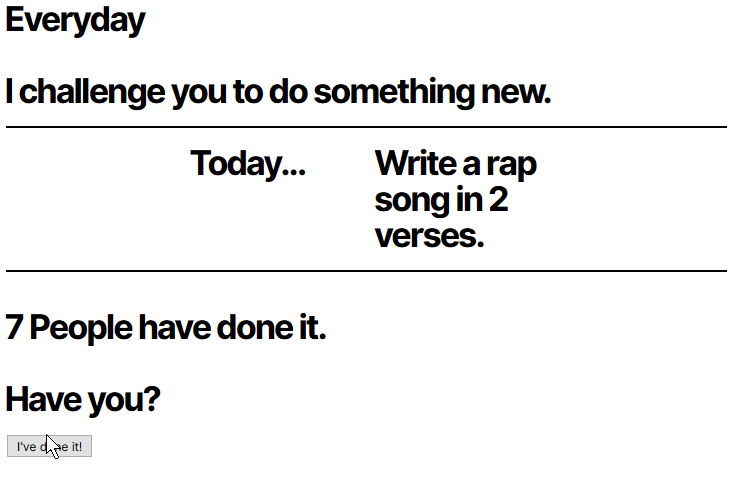

# Do something different

A quick php site to encourage people to do something new each day.
The site is designed to be lightweight.

## Instructions
  - PHP 7.0 - Earlier versions may work.
  - `composer install`
  - mysql pdo driver needs to be enabled to connect to database
  - Run the sql script in the `database\` folder to generate the table
  - Rename `example.env` to `.env` and fill in the details

## Todo
  - CSS, colouring perhaps?
  - Test mobile responsiveness

